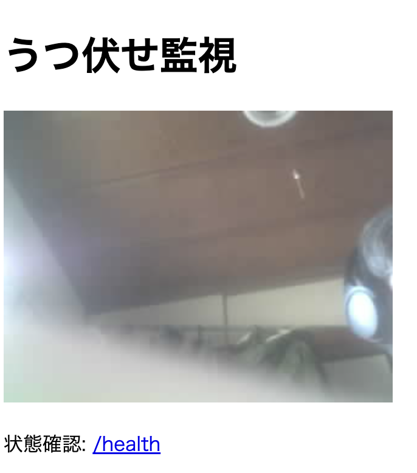

# prone-guard

Freenove ESP32-S3 WROOM CAM を使い、顔認識可否を監視して状態を公開するプロジェクトです。

現状は、`espressif/human_face_detect` コンポーネント（MSR+MNP）で顔認識可否のみを監視する実験コードです。
うつ伏せ検知モデルは未実装のため、現時点の判定は顔検知ベースにとどまります。

## 目的

- ESP-IDF + ESP-DL でローカル推論を行う。
- Wi-Fi STA で既存アクセスポイントへ接続する。
- HTTP サーバでカメラ映像を配信し、顔未認識時に障害状態へ遷移する。

## 現在の状態

- プロジェクト雛形を作成済み。
- `main/main.c` に Wi-Fi STA 接続、`GET /`、`GET /health` の最小実装を追加済み。
- `GET /stream` は MJPEG 配信を実装済み（カメラ初期化失敗時のみ `503`）。
- 顔認識の状態遷移ロジック（3秒間顔未認識で `FAULT_INFERENCE`、再認識で `MONITORING`）は実装済み。
- 顔検知成立時のみ、検知領域へ赤枠を重畳して `/stream` に配信する。
- `main/prone_inference_bridge.cpp` で `human_face_detect_msr_s8_v1.espdl` と `human_face_detect_mnp_s8_v1.espdl` の2モデルを用いた推論実装を追加済み。
- ESP-DL と `esp32-camera` 依存は `main/idf_component.yml` に追加済み。

## ドキュメント

- 要件定義: `docs/REQUIREMENTS.md`
- 設計書: `docs/DESIGN.md`
- 仕様書: `docs/SPECIFICATIONS.md`
- 実装 TODO: `docs/TODO.md`
- 環境構築手順: `docs/SETUP.md`
