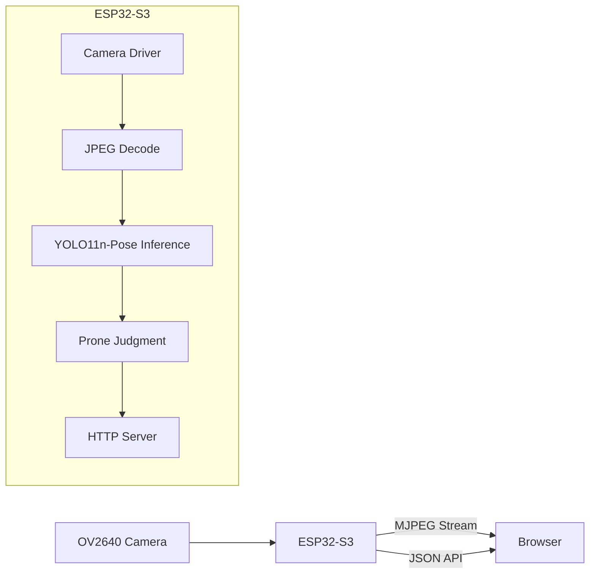
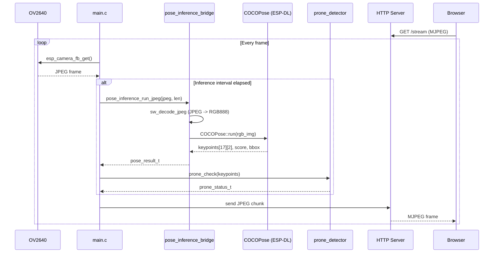

# 設計: うつ伏せ検知システム (prone-guard)

## 1. システム概要

ESP32-S3 上で YOLO11n-Pose モデルによる姿勢推定を実行し、キーポイント座標からうつ伏せ状態を判定する単体デバイスシステム。



## 2. ソフトウェア構成

### 2.1 コンポーネント依存関係

```text
prone-guard (project)
├── main/
│   ├── main.c                       ... app_main, Wi-Fi, HTTP, カメラ, 状態管理
│   ├── pose_inference_bridge.cpp    ... ESP-DL C++ API ラッパー (C リンケージ)
│   ├── pose_inference_bridge.h      ... ブリッジ関数宣言
│   ├── prone_detector.c             ... キーポイントからうつ伏せ判定
│   ├── prone_detector.h             ... 判定関数宣言
│   ├── models/                      ... .espdl モデルファイル配置用
│   └── idf_component.yml           ... 依存定義
├── partitions.csv
├── sdkconfig
└── docs/
```

### 2.2 外部依存コンポーネント

| Component              | Version | Description                |
| ---------------------- | ------- | -------------------------- |
| espressif/esp-dl       | ~3.2.0  | ESP-DL inference framework |
| espressif/coco_pose    | \*      | YOLO11n-Pose model wrapper |
| espressif/esp32-camera | ^2.1.3  | ESP32 camera driver        |

### 2.3 ファイル別責務

#### `main.c`

- `app_main`: 初期化シーケンス (NVS → Wi-Fi → カメラ → 推論 → HTTP サーバ)
- Wi-Fi STA モード管理 (固定 IP: 192.168.0.150)
- HTTP サーバ (ポート 80: HTML/API、ポート 81: MJPEG ストリーム)
- 状態遷移管理
- ストリームハンドラ内で推論を呼び出し

#### `pose_inference_bridge.cpp` / `.h`

- ESP-DL の `COCOPose` C++ クラスを C から利用するためのブリッジ層
- JPEG → RGB888 デコード
- `COCOPose::run()` を呼び出してキーポイント座標を取得
- 結果を C 構造体に変換して返却

#### `prone_detector.c` / `.h`

- キーポイント座標を入力として、うつ伏せ状態を判定する純粋な C モジュール
- 判定ロジックの詳細は `SPECIFICATIONS.md` に定義

## 3. データフロー



## 4. 状態遷移

```mermaid
stateDiagram-v2
    [*] --> BOOT
    BOOT --> WIFI_CONNECTING: Wi-Fi start
    WIFI_CONNECTING --> READY: IP acquired
    WIFI_CONNECTING --> WIFI_CONNECTING: retry (5s)
    READY --> MONITORING: camera + inference OK
    READY --> FAULT_CAMERA: camera init fail
    MONITORING --> ALERT: prone detected (hold time elapsed)
    ALERT --> MONITORING: prone cleared
    MONITORING --> FAULT_CAMERA: camera error
    MONITORING --> FAULT_INFERENCE: inference error
    FAULT_INFERENCE --> MONITORING: inference recovered
```



## 5. ネットワーク設計

### 5.1 Wi-Fi

- モード: STA
- SSID / パスワード: `sdkconfig` の `CONFIG_WIFI_SSID` / `CONFIG_WIFI_PASSWORD`
- 固定 IP: 192.168.0.150 (サブネット: 255.255.255.0, ゲートウェイ: 192.168.0.1)
- DHCP 不使用

### 5.2 HTTP エンドポイント

| Port | Path       | Method | Description                            |
| ---- | ---------- | ------ | -------------------------------------- |
| 80   | /          | GET    | HTML (stream viewer + status)          |
| 80   | /health    | GET    | JSON (system health)                   |
| 80   | /keypoints | GET    | JSON (latest keypoints + prone status) |
| 81   | /stream    | GET    | MJPEG stream                           |

## 6. メモリ配置

- カメラフレームバッファ: PSRAM (`CAMERA_FB_IN_PSRAM`)
- ESP-DL 推論バッファ: 静的メモリプランナーが内部 SRAM / PSRAM を自動配分
- モデルファイル: Flash `models` パーティションから読み取り

## 7. パーティション設計

```csv
# Name,     Type,    SubType,  Offset,    Size
nvs,        data,    nvs,      0x9000,    0x6000
phy_init,   data,    phy,      0xf000,    0x1000
factory,    app,     factory,  0x10000,   0x600000
models,     data,    spiffs,   0x610000,  0x400000
storage,    data,    spiffs,   0xA10000,  0x5F0000
```

- `factory`: 6 MB (アプリケーション)
- `models`: 4 MB (YOLO11n-Pose `.espdl` モデル、約 3 MB)
- `storage`: 残り領域 (将来拡張用)
- Flash 合計: 16 MB
